<!-- ═══════════════════════════ BANNER ═══════════════════════════ -->
<div align="center">
  
</div>

<!-- ═══════════════════════════ TYPING ═══════════════════════════ -->
<div align="center">
  <a href="https://www.linkedin.com/in/rodrigo-fernandez-761922270/">
    
  </a>
</div>

<!-- ═══════════════════════════ BADGES ═══════════════════════════ -->
<div align="center">
  
  
  
</div>

<br />

<!-- ═══════════════════════════ SOBRE MÍ ═══════════════════════════ -->
## 🚀 Sobre mí

```yaml
nombre:     Rodrigo Fernández
rol:        Full-Stack Developer
enfoque:    [ Aplicaciones web, APIs REST, CI/CD ]
stack:      [ React, Node.js, Python, Java ]
principios: [ Clean Architecture, Código mantenible, Buen rendimiento ]
aprendiendo: [ Cloud, Testing automatizado, Observabilidad ]
```

- 🧩 Construyo productos de punta a punta: del diseño de la API hasta la interfaz final.
- 🏗️ Me interesan las **arquitecturas limpias**, el **modelado de datos** y las **APIs bien documentadas**.
- ⚙️ Automatizo builds, tests y despliegues con **Jenkins** y **Docker**.
- 🎯 Objetivo: soluciones simples, rápidas y fáciles de mantener por otros.

<br />

<!-- ═══════════════════════════ STACK ═══════════════════════════ -->
## 🧰 Stack Tecnológico

<table>
  <tr>
    <td valign="top" width="50%">

**🎨 Frontend**

<p>


</p>

  </td>
    <td valign="top" width="50%">

**⚙️ Backend**

<p>


</p>

  </td>
  </tr>
  <tr>
    <td valign="top" width="50%">

**📱 Móvil & UI/UX**

<p>


</p>

  </td>
    <td valign="top" width="50%">

**🐳 DevOps & Datos**

<p>


</p>

  </td>
  </tr>
</table>

<br />

<!-- ═══════════════════════════ PROYECTOS ═══════════════════════════ -->
## 📌 Proyectos Destacados

<!-- 👉 Reemplaza los nombres de repo por los tuyos. Si un repo no existe, la tarjeta no se mostrará. -->
<div align="center">
  <a href="https://github.com/RFZ-12/NOMBRE-REPO-1">
    
  </a>
  <a href="https://github.com/RFZ-12/NOMBRE-REPO-2">
    
  </a>
</div>

| Proyecto | Descripción | Stack |
|---|---|---|
| **Proyecto 1** | Breve descripción del problema que resuelve y su resultado. | `React` `Node.js` `PostgreSQL` |
| **Proyecto 2** | Breve descripción del problema que resuelve y su resultado. | `Django` `Docker` `Jenkins` |
| **Proyecto 3** | Breve descripción del problema que resuelve y su resultado. | `Flutter` `Firebase` |

<br />

<!-- ═══════════════════════════ CI/CD ═══════════════════════════ -->
## 🔁 CI/CD — Jenkins + Docker

> Del *commit* a producción sin intervención manual: build reproducible, calidad verificada, imagen versionada y despliegue con *rollback* disponible.

```mermaid
flowchart LR
    subgraph SRC["🧑‍💻 Origen"]
        A["Commit / Pull Request"] --> B["Webhook a Jenkins"]
    end

    subgraph CI["⚙️ Integración Continua"]
        B --> C["Checkout + Cache de dependencias"]
        C --> D["Lint / Formato"]
        C --> E["Tests unitarios + Cobertura"]
        C --> F["Análisis estático - SonarQube"]
        D --> G{"¿Quality Gate?"}
        E --> G
        F --> G
    end

    G -- "❌ Falla" --> X["Build marcado como fallido<br/>Notificación al equipo"]

    subgraph BUILD["🐳 Empaquetado con Docker"]
        G -- "✅ Pasa" --> H["Docker build - multi-stage"]
        H --> I["Escaneo de vulnerabilidades - Trivy"]
        I --> J["Tag semántico: v1.4.2 + SHA"]
        J --> K["Push al Container Registry"]
    end

    subgraph CD["🚀 Entrega Continua"]
        K --> L["Deploy a Staging<br/>docker compose up -d"]
        L --> M["Smoke tests + Health checks"]
        M --> N{"¿Aprobación manual?"}
        N -- "Sí" --> O["Deploy a Producción<br/>Blue-Green / Rolling"]
        O --> P["Health check post-deploy"]
        P -- "❌" --> Q["Rollback automático<br/>a la imagen anterior"]
        P -- "✅" --> R["Release estable<br/>Monitoreo + Logs"]
    end
```



### 🐳 Cómo trabajo con Docker

| Práctica | Qué aporta |
|---|---|
| **Builds multi-stage** | Imágenes finales ligeras: se compila en una etapa y solo se copia el artefacto final. |
| **Imágenes base slim/alpine + usuario no-root** | Menor superficie de ataque y arranque más rápido. |
| **Tags inmutables** (`v1.4.2`, `sha-a1b2c3d`) | Cada despliegue es rastreable y reversible; nada de `latest` en producción. |
| **Escaneo de imágenes en el pipeline** | Las vulnerabilidades críticas frenan el build antes de llegar al registry. |
| **`docker compose` por entorno** | Dev, staging y producción parten del mismo artefacto, solo cambian variables. |
| **Health checks + rollback** | Si el contenedor nuevo no responde sano, se restaura la versión anterior automáticamente. |
| **Cache de capas y de dependencias** | Pipelines más cortos y builds predecibles. |

<details>
<summary><b>📄 Ver ejemplo de Jenkinsfile</b></summary>

```groovy
pipeline {
  agent any

  environment {
    REGISTRY  = 'registry.midominio.com'
    IMAGE     = "${REGISTRY}/app"
    TAG       = "${env.BUILD_NUMBER}-${env.GIT_COMMIT.take(7)}"
  }

  options {
    timestamps()
    buildDiscarder(logRotator(numToKeepStr: '20'))
  }

  stages {
    stage('Checkout')  { steps { checkout scm } }

    stage('Calidad') {
      parallel {
        stage('Lint')  { steps { sh 'npm run lint' } }
        stage('Tests') { steps { sh 'npm test -- --coverage' } }
      }
      post { always { junit 'reports/**/*.xml' } }
    }

    stage('Build imagen') {
      steps { sh "docker build -t ${IMAGE}:${TAG} -t ${IMAGE}:stable ." }
    }

    stage('Escaneo de seguridad') {
      steps { sh "trivy image --exit-code 1 --severity HIGH,CRITICAL ${IMAGE}:${TAG}" }
    }

    stage('Push al registry') {
      steps {
        withCredentials([usernamePassword(credentialsId: 'registry-creds',
                                          usernameVariable: 'U', passwordVariable: 'P')]) {
          sh 'echo $P | docker login $REGISTRY -u $U --password-stdin'
          sh "docker push ${IMAGE}:${TAG}"
        }
      }
    }

    stage('Deploy a Staging') {
      steps { sh "IMAGE_TAG=${TAG} docker compose -f compose.staging.yml up -d --remove-orphans" }
    }

    stage('Aprobación') {
      steps { input message: '¿Desplegar a producción?', ok: 'Desplegar' }
    }

    stage('Deploy a Producción') {
      steps { sh "IMAGE_TAG=${TAG} ./scripts/deploy-prod.sh" }
    }
  }

  post {
    failure { echo '❌ Pipeline fallido — ejecutando rollback'; sh './scripts/rollback.sh' }
    success { echo "✅ Desplegado correctamente: ${IMAGE}:${TAG}" }
  }
}
```

</details>

<br />

<!-- ═══════════════════════════ ESTADÍSTICAS ═══════════════════════════ -->
## 📊 Estadísticas de GitHub

<div align="center">
  
  
</div>

<div align="center">
  
</div>

<div align="center">
  
</div>

<div align="center">
  
</div>

<br />

<!-- ═══════════════════════════ CONTACTO ═══════════════════════════ -->
## 📫 Contacto

<div align="center">
  <a href="mailto:rodrigozavaleta12@gmail.com">
    
  </a>
  <a href="https://www.linkedin.com/in/rodrigo-fernandez-761922270/">
    
  </a>
  <a href="https://github.com/RFZ-12">
    
  </a>
</div>

<br />

<div align="center">
  <i>💬 Abierto a colaboraciones, proyectos freelance y nuevas oportunidades.</i>
</div>

<!-- ═══════════════════════════ FOOTER ═══════════════════════════ -->


<!--
💡 EXTRA OPCIONAL — Animación de la serpiente comiendo tus contribuciones:
1. Crea el archivo .github/workflows/snake.yml con la acción "Platane/snk".
2. Luego agrega aquí:
<div align="center">
  
</div>
-->
